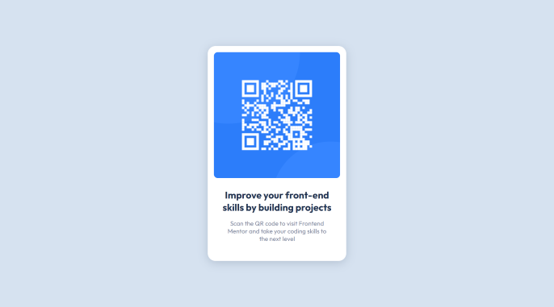

# Frontend Mentor - QR Code Component Solution

This is a solution to the [QR code component challenge on Frontend Mentor](https://www.frontendmentor.io/challenges/qr-code-component-iux_sIO_H). Frontend Mentor challenges help you improve your coding skills by building realistic projects. 

## Table of contents

- [Overview](#overview)
  - [Screenshot](#screenshot)
  - [Links](#links)
- [My process](#my-process)
  - [Built with](#built-with)
  - [Continued development](#continued-development)
- [Author](#author)

## Overview

### Screenshot

### Links

- Solution URL: [https://github.com/codebygrace/FEM-qr-code](https://github.com/codebygrace/FEM-qr-code)
- Live Site URL: [https://codebygrace.github.io/FEM-qr-code](https://codebygrace.github.io/FEM-qr-code)

## My process

### Built with

- Semantic HTML5 markup
- CSS custom properties
- Flexbox

### Continued development

I plan to come back to this project and make it fully responsive so that it adjusts with several different screen sizes, including tablet sizes. I also plan to possibly make some design updates just for fun. 

## Author

- LinkedIn - [Grace Mills](https://www.linkedin.com/in/codebygrace)
- Frontend Mentor - [@codebygrace](https://www.frontendmentor.io/profile/codebygrace)
- Instagram - [@code.bygrace](https://www.instagram.com/code.bygrace)